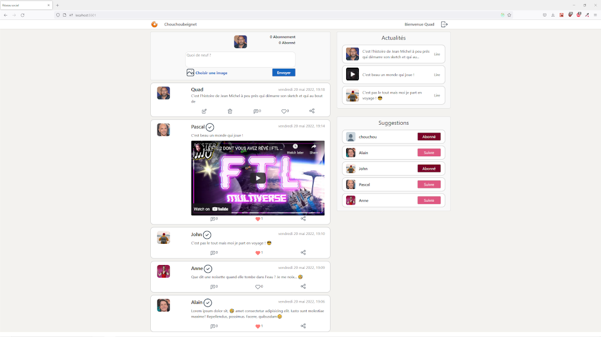
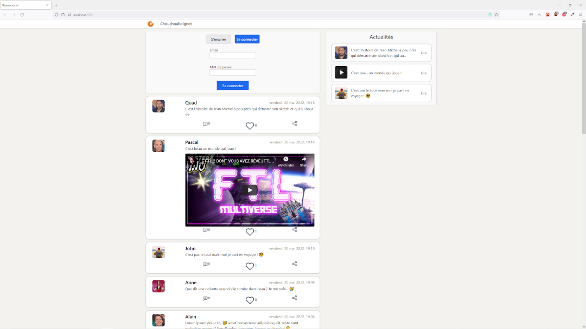

# React social network

---

Un simple réseau social créé avec le framework React.

---

## Objectives :

---

L'idée était de réaliser un premier "gros projet" qui fait appel à un serveur + base de données. Avec l'application, il est possible de :

- consulter les threads constituer de messages et / ou d'images et de vidéos (partie centrale),
- liker, commenter et partager les posts,
- visualiser l'actualité / tendance constituée de 3 posts récents (en haut à droite) : possibilité de les consulter en cliquant dessus,
- visualiser des suggestions de personnes à follow (à droite) : possibilité de follow ou unfollow.

## Technologies used :

---

L'application est séparée en deux parties : back et front. C'est pourquoi, il est nécessaire de faire tourner deux terminaux :

- Pour la partie back-end, il suffit de taper la commande "npm start" (port 3000).
- Pour la partie front, il suffit de taper la commande "npm run start-front" (port 5501).-

Voici les technos principalement utilisées :

- Back : Express, MongoDB
- Front : React, Redux, Axios
